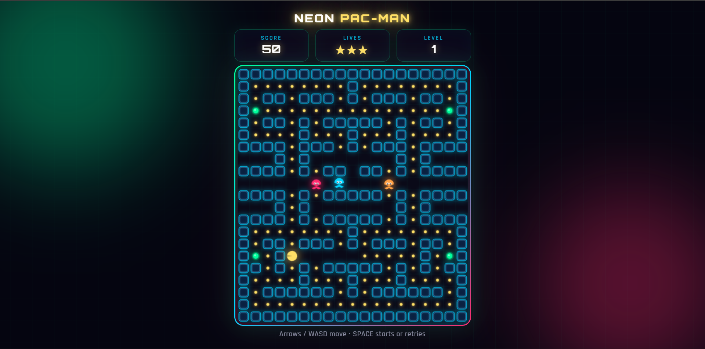

# Neon Pac-Man



A modern, neon-styled Pac-Man game built with pure HTML, CSS, and vanilla JavaScript (HTML5 Canvas).

**No external image assets required** — everything is drawn on canvas.

---

## Play

[play here](https://souravbanerjeedata.github.io/pacman/)

---

## Features

- **Neon visual design** — glowing walls, pulsing power pellets, neon Pac-Man & ghosts
- **Power pellets** — eat ghosts for bonus points (chain multiplier)
- **Tunnel wrap** — use the marked center tunnel to appear on the other side
- **Smart-ish ghost AI** — chase when normal, flee when scared, return home when eaten
- **Lives system** (3) + level progression; collected pellets stay collected after losing a life
- **Score** — pellets, power pellets, eaten ghosts, level clear bonus
- **Mouth animation** & scared-ghost blinking near end of power mode
- **Mobile-friendly** — swipe to move
- Fully responsive (tile size scales to screen)

---

## Controls

### Desktop

| Key     | Action          |
| ------- | --------------- |
| ← → ↑ ↓ | Move            |
| W A S D | Move            |
| Space   | Start / Restart |

### Mobile

1. Tap **START**
2. **Swipe** in any direction to move Pac-Man

---

## Scoring

| Action            | Points            |
| ----------------- | ----------------- |
| Pellet            | 10                |
| Power pellet      | 50                |
| 1st ghost eaten   | 200               |
| 2nd ghost (chain) | 400               |
| 3rd               | 800               |
| 4th               | 1600              |
| Level clear       | 500 × (level − 1) |

Levels reuse this maze. Ghost speed rises through the first 13 levels, while power-pellet time decreases to a four-second minimum. The level transition pauses movement and advances the maze only once before the next round begins.

---

## Project Structure

```
pacman/
├── index.html   # Markup + modals
├── style.css    # Neon theme, responsive layout
├── app.js       # Full game logic (canvas drawing + AI)
└── README.md
```

No build step. No dependencies. No image files.

---

## Improvements over the original

The original repo was a basic Kenny Yip tutorial (PNG sprites, simple random ghost movement, no power pellets, no tunnels, minimal UI).

This version adds:

- Full neon aesthetic matching Neon Snake / Neon Tetris
- Pure canvas rendering (no PNG assets)
- Power pellets + scared / eaten ghost states
- Tunnel wrap-around
- Better ghost AI (chase / flee / return home)
- Lives, levels, progressive difficulty
- Start / Game Over / Level Clear modals
- Swipe controls for mobile
- Responsive scaling
- Polished HUD (score, lives, level)

---

## Author

**Sourav Banerjee**

GitHub: [Souravbanerjeedata](https://github.com/Souravbanerjeedata)
